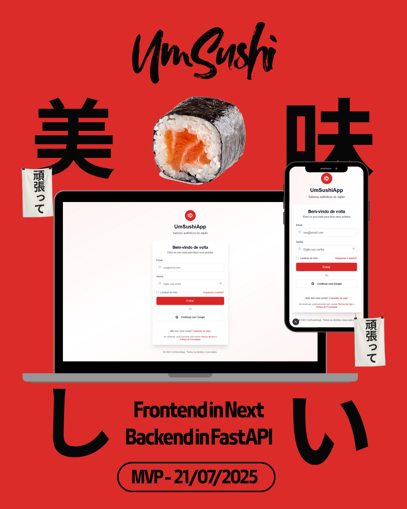

  

# 💳 Sistema de Pagamento — UM Sushi 🍣  
**Squad 4**  
Projeto acadêmico desenvolvido na disciplina **MATA55 - Programação Orientada a Objetos** (UFBA - 2025.1) com base em um cliente real: o restaurante UM Sushi.

---

## 👥 Equipe — Squad 4
- Victor  
- Pedro  
- Mateus  
- Eduarda  
- Jimmy  
- Gabriel  
- João  
- Fernando  

---

## 🎯 Objetivo do Projeto

Desenvolver um **sistema de pagamento modular** para um aplicativo web/mobile de delivery de sushi, implementando boas práticas de **Programação Orientada a Objetos (POO)**, com foco em **refatoração progressiva e melhoria contínua** da arquitetura.

---

## 🧱 Arquitetura

O sistema é dividido em **camadas** e segue uma abordagem de microserviço desacoplado:

- `Apresentação (UI/Admin)`: exibição e consulta de status de pagamento.
- `Aplicação (Service Layer)`: orquestra o fluxo de pagamentos.
- `Domínio`: modelos e regras de negócio (Payment, Order, etc).
- `Infraestrutura`: gateways de pagamento simulados (Pix, Cartão, Wallet).

---

## 📅 Cronograma de Entregas

| Data       | Entrega                             |
|------------|--------------------------------------|
| 28/04      | Modelagem inicial do sistema         |
| 05/05      | Implementação de pagamento via Pix   |
| 12/05      | Cartão de crédito e débito           |
| 19/05      | Entrega da Fase 1                    |
| 26/05      | Cadastro de clientes e regiões       |
| 02/06      | Relatórios e valores acumulados      |
| 09/06      | Entrega da Fase 2                    |
| 16/06      | Refatoração, logs, tratamento de erros |
| 23/06      | Organização modular e melhorias      |
| 07/07      | Apresentação simulada                |
| 21/07      | Entrega final                        |

---

## 🧪 Testes

Todos os módulos entregues devem conter:
- Testes unitários com dados simulados.
- Simulação de pedidos e integrações mockadas.
- Feedbacks contínuos com foco em refatoração limpa.

---

## 💻 Tecnologias Utilizadas

- Linguagem: Python
- Framework Principal: FastAPI
- Versionamento: GitHub
- Testes: Pytest
- Integração futura com mensageria (eventualmente com RabbitMQ ou Kafka)
- Interface: Next.JS (Ou definida em sala de aula)

---

## 📁 Estrutura do Projeto

---

## 📚 Referências da Disciplina

- **POO na prática:** abstração, herança, polimorfismo e encapsulamento.
- **Clean Code, Martin Fowler.**
- **Stack Trace, tratamento de exceções e debugging.**

---

## 📌 Requisitos da Entrega

- Projeto modular com responsabilidade única por classe.
- Aplicação realista, mesmo com dados mockados.
- Implementação de logs e tratamento de erros.
- Histórico de commits organizados por funcionalidade.
- Apresentação final com demonstração funcional.

---

## 🐙 Repositório oficial

- Backend: Neste diretório está contido o PoC ("Prova de Conceito" (Proof of Concept)) em arquitetura Hexagonal (referência: https://medium.com/bemobi-tech/arquiteturas-de-software-a4c55749a7eb)
---
